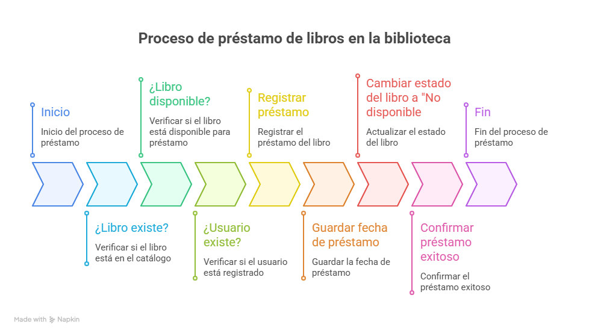

# Sistema de Gestión de Biblioteca

Proyecto demo desarrollado en Python para gestionar:

- Libros
- Usuarios
- Préstamos
- Devoluciones

## Requisitos

Python 3.10+

## Diagrama de Flujo del funcionamiento del programa



## Ejecución

```bash
Dicampus_IA\proyectos\reto_modulo_1_biblioteca> python -m biblioteca.py 


## Ejecución de Pruebas
```bash
Dicampus_IA\proyectos\reto_modulo_1_biblioteca> python -m pytest


Uso de IA en este proyecto:

Resumen de fallas de seguridad

Riesgo--Severidad--Solución recomendada
usuario_id = int(input(...)) sin manejo--Medio--Validar con try/except
Inputs de texto sin validación--Bajo--Sanitizar, limitar longitud
Mensajes de error demasiado detallados--Bajo-Medio--Generalizar mensajes en producción
Concurrencia y listas compartidas--Medio-Alto--Bloqueos o DB con transacciones
Futura persistencia insegura--Medio--Sanitización, escapar caracteres, no usar eval
Email/ISBN no validados--Bajo--Regex o librerías de validación


Origen del código:

No fue copiado de ningún repositorio ni libro.

Fue generado íntegramente por mí (ChatGPT) en esta conversación.

La generación se basó en patrones estándar de programación en Python, buenas prácticas de OOP y pruebas unitarias con pytest.

Inspiración conceptual: manejo típico de sistemas de biblioteca (CRUD libros, usuarios, préstamos) que es un ejemplo clásico en enseñanza de programación.

Ninguna línea proviene de código con copyright o de proyectos externos; todo es original para tu caso.

Nota del usuario: En una búsqueda avanzada en google no se ha podido encontrar una referencia directa al código, pero en las páginas relacionadas aparece una página
relacionada tangencialmente con el código para hacer un CRUD:

https://oneuptime.com/blog/post/2026-02-03-django-ninja-rest-apis/view

El tutorial está escrito por Nawaz Dhandala y el código es Open Source.

Tanto el programa biblioteca.py como el programa test_biblioteca.py se realizaron en un 90% por Chat-GPT y un 10% por el usuario (corrección de directorios, cortar y pegar funciones).

Reglas personales para utilizar la IA:

-Ser claro, directo y minucioso con los prompts. Cuanto más detallados y den menos lugar a interpretación, mejor.
-Guardar varias versiones del código y no modificar con lo que propone la IA de buenas a primeras. Respaldar, Copiar y Testear.
-Estar atento a que en ocasiones la IA pierde el hilo de la conversación y genera código incompatible con lo anterior.


